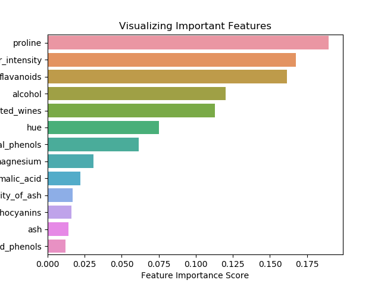

# cebd1160_project
CEBD 1160 - Winter 2019 - Final Project

| Name | Date |
|:-------|:---------------|
|Ricardo Rocha| March 30, 2019|

-----

### Resources
My repository includes the following:

- Python script for my analysis: `wine_data_parser_classifier.py`
- Results figure/saved file: `/figures`
- Dockerfile for my experiment: `Dockerfile`
- runtime-instructions in a file named RUNME.md

-----

## Research Question
Which of the classes (0,1,2) contains the major proportion of wines with more quantity of alcohol and with higher color intensity?

### Abstract

From a well-known wine dataset from UCI ML Wine recognition datasets, I analyze two wine characteristics (alcohol and color intensity) and check if there is a correlation between them and classes of wine. Maybe using this data, we can classify some wine based on these two characteristics. Firstly, I checked the correlation between those two characteristics. Then, I checked the relation between that first information and the classes of wine 0, 1 and 2. Here, I found a 0.55 (up to 1.0) co-relation between the alcohol and color intensity. And Class 2 is the one that contains the most wines with these characteristics.

### Introduction

The dataset is a copy of UCI ML Wine recognition datasets. The data are the results of a chemical analysis of wines grown in the same region in Italy by three different cultivators. There are thirteen different measurements taken for different constituents found in the three types of wine. All the information is found in [https://scikit-learn.org/stable/datasets/index.html#wine-dataset](https://scikit-learn.org/stable/datasets/index.html#wine-dataset)

### Methods

In order to discover the potential co-relation amongst alcohol and color_intensity, the method used for visualizing in two dimensions (2-D) this data was to leverage a pair-wise co-relation matrix and depict it as a heatmap (can be found [here](https://towardsdatascience.com/the-art-of-effective-visualization-of-multi-dimensional-data-6c7202990c57)). The methods utilized to discover the occurrence of the wines per class and based on those characteristics was the K-Nearest Neighbor(KNN) Classification (can be found [here](https://www.datacamp.com/community/tutorials/k-nearest-neighbor-classification-scikit-learn)) and the Random Forests Classification (can be found [here](https://www.datacamp.com/community/tutorials/random-forests-classifier-python#building). 

The pseudocodes for such methods can be found in:
[Knn Pseudocode](https://towardsdatascience.com/k-nearest-neighbours-introduction-to-machine-learning-algorithms-18e7ce3d802a)
[Random Forest Pseudocode](https://syncedreview.com/2017/10/24/how-random-forest-algorithm-works-in-machine-learning/)

In the heatmap, we can see that the correlation between alcohol and color_intensity is 0.55. So, it is above average if we check the "thermometer" of correlations on the right side of the figure that goes up to 1.0. 

### Results
After plotting the pair-wise correlation matrix heatmap, I plotted figures for 1, 3 and 5 neighbors trying to improve the performance of the KNN algorithm on the wine dataset. But the best accuracy that I got for this classifier was 0.78 up to 1.0.

Then I tried the Random Forest mentioned by Jonathon Bechtel in https://jonathonbechtel.com/blog/2018/02/06/wines/ as being one of the best options to work with this dataset. In fact, the accuracy for this method is almost optimal for this dataset and sometimes running this method I got 1.0 of a result. I could even discover more important constituents for the wine dataset.

In the end, I tried to check witch other sets of constituents of the wines in that dataset could give me better results. Based on the heatmap, I plot the KNN for total_phenols and flavanoids (with the highest co-relation of 0.86) and based on the most important features for alcohol and proline. 

 

### Discussion
I think my question was answered in part. There is a correlation between alcohol and color_intensity over the average. But I am not sure about the use of KNN to determine the class with most samples of wines with a higher quantity of alcohol and color_intensity. Here, I assumed that the class_2 is the one because I predicted with KNN the neighbors closer to the maximum values found in the dataset for alcohol and color_intensity. Next steps are checking this with other methods more accurate. Also, other datasets with similar features could be checked to answer similar questions.

### References

The links referenced were included in my discussion, above.

-------
