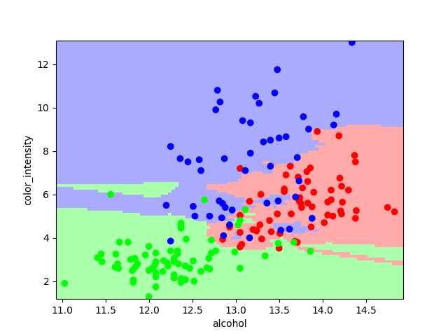

# cebd1160_project
CEBD 1160 - Winter 2019 - Final Project

| Name | Date |
|:-------|:---------------|
|Ricardo Rocha| March 29, 2019|

-----

### Resources
Your repository should include the following:

- Python script for your analysis: `wine_data_parser_classifier.py`
- Results figure/saved file: `/figures`
- Dockerfile for your experiment: `Dockerfile`
- runtime-instructions in a file named RUNME.md

-----

## Research Question
Which of the classes (0,1,2) contains the major proportion of wines with more quantity of alcohol and with higher color intensity?

### Abstract

From a well known Wine dataset from UCI ML Wine recognition datasets, I thought I could analize two wine characteristics, alcohol and color intensity, and check if there is a relation between them and classes of wine. Using these data, we may be able to classify some wine based on these two characteristics. Firstly, I checked the co-relation between those two characteristics. Then, I checked the relation between that first information and the classes of wine 0, 1 and 2. Here, I found a 0.55 (up to 1.0) co-relation between the alcohol and color intensity. And the class 2 is the one that contains more wines with these characteristics.

### Introduction

The dataset is a copy of UCI ML Wine recognition datasets. The data is the results of a chemical analysis of wines grown in the same region in Italy by three different cultivators. There are thirteen different measurements taken for different constituents found in the three types of wine. All the information is found in [https://scikit-learn.org/stable/datasets/index.html#wine-dataset](https://scikit-learn.org/stable/datasets/index.html#wine-dataset)

### Methods

	In order to discover the potential co-relation amongst alcohol and color_intensity, the method used for visualizing in two dimensions (2-D) this data was to leveragea pair-wise correlation matrix and depict is as a heatmap (can be found in [https://towardsdatascience.com/the-art-of-effective-visualization-of-multi-dimensional-data-6c7202990c57](https://towardsdatascience.com/the-art-of-effective-visualization-of-multi-dimensional-data-6c7202990c57)). The method utilized to discover the ocurrence of the wines per class and based on those characteristics was the K-Nearest Neighbor(KNN) Classification (can be found [https://www.datacamp.com/community/tutorials/k-nearest-neighbor-classification-scikit-learn](https://www.datacamp.com/community/tutorials/k-nearest-neighbor-classification-scikit-learn)). 
	In the heatmap we can see that the correlation between alcohol and color_intensity is 0.55. So, it is above average if we check the "termometre" at the right side of the figure that goes up to 1.0. 

### Results

### Discussion

### References

The links referenced were included in my discussion, above.

-------
